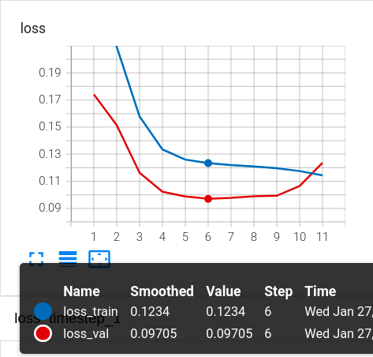
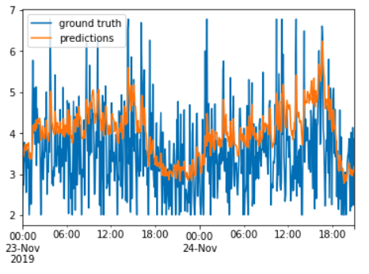
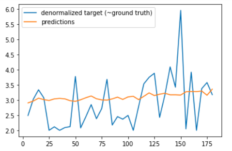
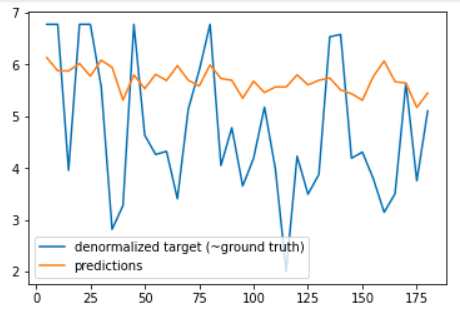
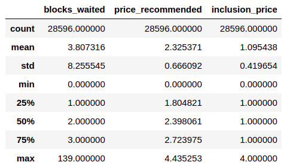
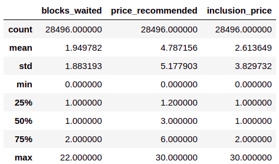
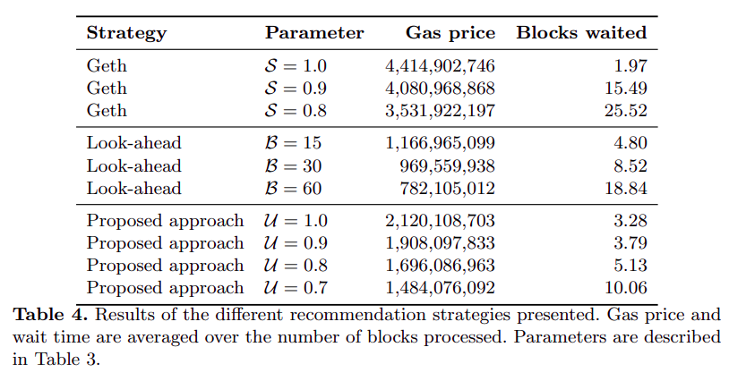

[![Stargazers][stars-shield]][stars-url]
[![Issues][issues-shield]][issues-url]
[![MIT License][license-shield]][license-url]

<!-- PROJECT LOGO -->
 

  <h3 align="center">Ethereum Deep Gas Price Oracle</h3>

  

    This is an unofficial implementation of the paper: <a href=https://arxiv.org/abs/2003.03479>Step on the Gas? A Better Approach for Recommending the Ethereum Gas Price</a> (by Sam M. Werner, Paul J. Pritz, Daniel Perez)!
     

<!-- TABLE OF CONTENTS -->

  
Table of Contents

  <ol>
    <li>
      <a href="#about-the-project">About The Project</a>
      <ul>
        <li><a href="#built-with">Built With</a></li>
      </ul>
    </li>
    <li>
      <a href="#getting-started">Getting Started</a>
      <ul>
        <li><a href="#prerequisites">Prerequisites</a></li>
        <li><a href="#installation">Installation</a></li>
      </ul>
    </li>
    <li><a href="#usage">Usage</a></li>
    <li><a href="#roadmap">Roadmap</a></li>
    <li><a href="#contributing">Contributing</a></li>
    <li><a href="#license">License</a></li>
    <li><a href="#contact">Contact</a></li>
    <li><a href="#acknowledgements">Acknowledgements</a></li>
  </ol>

<!-- ABOUT THE PROJECT -->
## About The Project

<!-- [![Product Name Screen Shot][product-screenshot]](https://example.com) -->

This is a price gas recommender for the Ethereum network. The network is trained to
predict the next `S`th prices (with a resampling over 5 minutes periods). As the minimum
gas price is very noisy, the idea is to predict the prices on the next minutes/hours.
From thoses predictions the algorithm will return a recommended price, 
taking into account the slope of the predictions.

Few plots from this repository:

Note: We try to forecast the minimum eth gas price over the next 3 hours.

The loss of the GRU model:

Model first timestamp predictions (5min) on the test range:

Some predictions over the 3 hours:

Results of the simulation between the block `8965759` and the block `8995344`:

DEEP GAS ORACLE :

GETH (my implementation):

As a comparison, here is the paper original results:

Note: I just tried a few different hyper-parameters but didn't have time to tune them yet.
My results are not as good as the paper but close to it.

### Built With

* Python
* Pytorch
* Pandas & Numpy
* Notebooks for visualisations

<!-- GETTING STARTED -->
## Getting Started

Follow the notebooks.

### Prerequisites

This run on python 3, you can find the requirements in : `requirements.txt`

Note: you need to have pip installed

### Datasets

To download the raw datasets, you need a google api key to use the BigQuery
service to be able to fetch historical eth blocks information.
Once you have the key, place the `json` file in the `credentials/` folder.

For the eth price, you can download it [here](https://www.kaggle.com/prasoonkottarathil/ethereum-historical-dataset?select=ETH_1min.csv) 
on Kaggle.

You should put the ETH price `csv` file in the `datasets/` folder.

### Installation

1 - Clone this repo

2 - Install the package with pip:

`pip install .`

<!-- USAGE EXAMPLES -->
## Usage

You can run the notebooks to:
* 01 -> Explore the data and preprocess it
* 02 -> Modelise the minimum gas prices (5min avg) with a GRU neural-network
* 03 -> Evaluate the recommendation made by the deep oracle VS "Geth strategy" 

<!-- LICENSE -->
## License

Distributed under the MIT License. See `LICENSE` for more information.

<!-- MARKDOWN LINKS & IMAGES -->
<!-- https://www.markdownguide.org/basic-syntax/#reference-style-links -->
[stars-shield]: https://img.shields.io/github/stars/louisoutin/deep_gas_oracle.svg?style=for-the-badge
[stars-url]: https://github.com/louisoutin/deep_gas_oracle/stargazers
[issues-shield]: https://img.shields.io/github/issues/louisoutin/deep_gas_oracle.svg?style=for-the-badge
[issues-url]: https://github.com/louisoutin/deep_gas_oracle/issues
[license-shield]: https://img.shields.io/github/license/othneildrew/Best-README-Template.svg?style=for-the-badge
[license-url]: https://github.com/louisoutin/deep_gas_oracle/blob/master/LICENSE.txt
